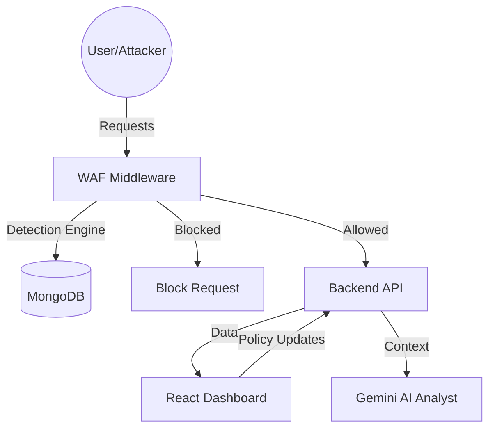

# 🛡️ YMCS Shield WAF - Smart Web Application Firewall

**YMCS Shield WAF** is an advanced, AI-driven Web Application Firewall (WAF) designed to protect modern web applications from common cyber threats while providing real-time analytics and intelligent threat analysis.


---

## 🚀 Features

- **Real-Time Threat Detection**: Identifies and blocks SQL Injection (SQLi), Cross-Site Scripting (XSS), and Path Traversal attacks.
- **AI Analyst Integration**: Powered by Google Gemini AI to provide forensic insights and security recommendations based on live traffic data.
- **Dynamic Security Policies**: Manage and toggle security rules (filters, rate limits, geoblocking) on-the-fly via the dashboard.
- **Interactive Dashboard**: Cinematic UI with real-time graphs, incident logs, and threat matrix visualizations.
- **Automated Reporting**: Generate professional PDF security reports at the click of a button.
- **Traffic Simulation**: Built-in traffic generator to simulate both legitimate and malicious traffic for testing and demonstration.

---

## 🛠️ Tech Stack

- **Frontend**: React.js, Lucide Icons, Recharts, Framer Motion (for animations).
- **Backend**: Node.js, Express.js.
- **Security Logic**: Custom WAF middleware with pattern-based detection and Google Gemini AI.
- **Database**: MongoDB (Mongoose ODM).
- **Infrastructure**: Helmet, CORS, Morgan, GeoIP-lite.

---

## 📦 Installation & Setup

### 1. Clone the Repository
```bash
git clone https://github.com/chinnu2523/ymcs-shield-waf.git
cd ymcs-shield-waf
```

### 2. Configure Backend
Navigate to the backend directory and set up your environment variables.
```bash
cd waf-backend
npm install
```
Create a `.env` file in `waf-backend/`:
```env
MONGODB_URI=your_mongodb_connection_string
GEMINI_API_KEY=your_google_gemini_api_key
PORT=4000
```

### 3. Configure Dashboard
Navigate to the dashboard directory and install dependencies.
```bash
cd ../waf-dashboard
npm install
```

---

## 🚦 Running the Application

### Start the Backend
```bash
cd waf-backend
npm start
```
The backend will run on `http://localhost:4000`.

### Start the Dashboard
```bash
cd waf-dashboard
npm start
```
The dashboard will open at `http://localhost:3000`.

---

## 🧪 Testing the WAF

To see the WAF in action, you can use the built-in traffic generator:

1.  Ensure the backend is running.
2.  Open a new terminal and navigate to `waf-backend`.
3.  Run the traffic generator:
    ```bash
    node traffic-generator.js
    ```
This will send a mix of legitimate and malicious requests (SQLi, XSS, etc.) to the server. You can watch the "Blocked Attacks" counter on the dashboard increase in real-time.

---

## 📊 Security Workflows

### AI Forensic Analysis
Ask the **AI Analyst** in the dashboard about recent incidents. For example: *"What kind of attacks have we seen in the last hour?"* or *"How can I improve my security policies?"*

### Policy Management
Use the **Settings** page in the dashboard to enable/disable specific filters or adjust rate limits. Changes are applied instantly to the backend.

### PDF Reports
Visit the **Reports** section to download a snapshot of your system's health and blocked threats in PDF format.

---

## 🏛️ Project Architecture



---

## 🛡️ License
Distributed under the ISC License. 

---
Developed for **Academic Submission - KL University**.
